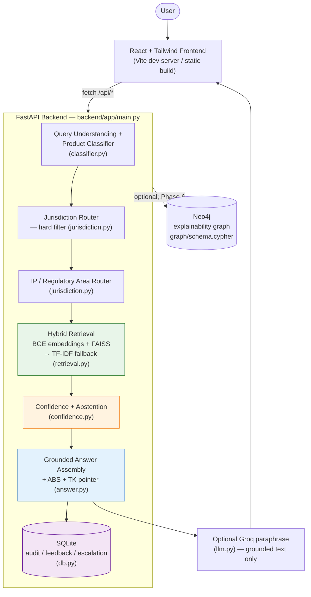
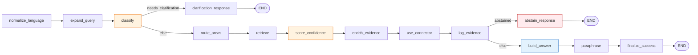
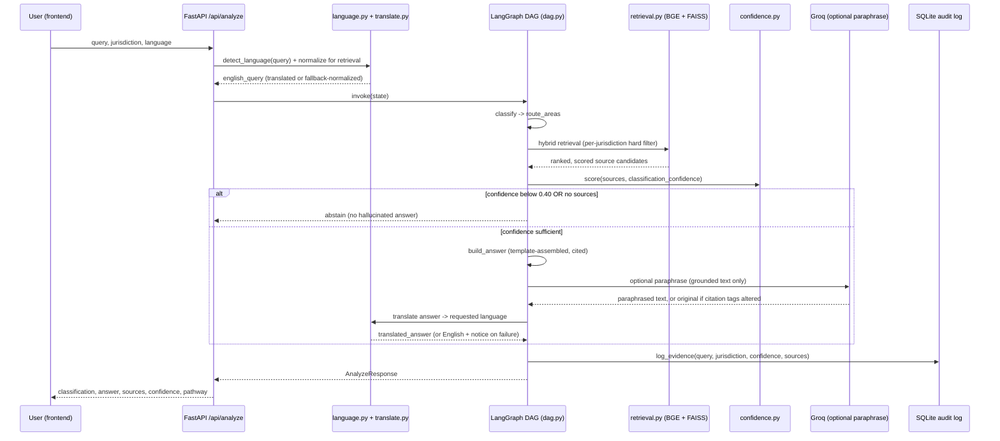
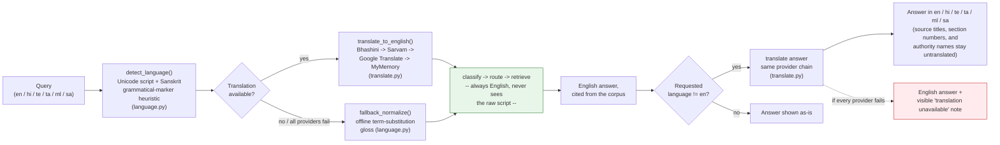
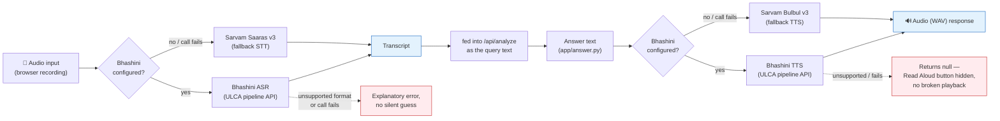
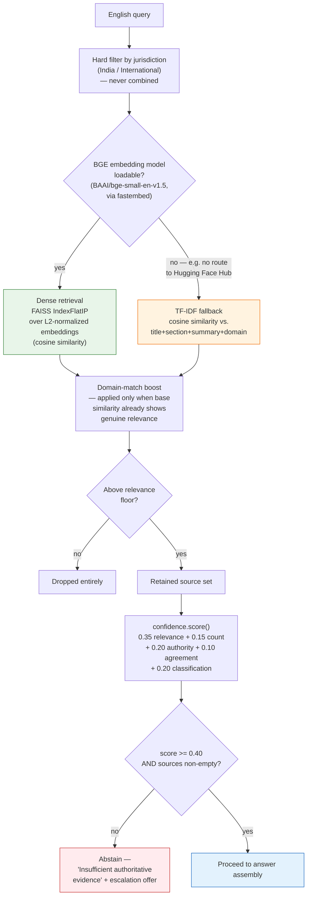

<div align="center">

# 🕉️ SUTRADHARA
### AI-Powered IP & Regulatory Intelligence for Ayurveda

**Team Chaturya · Smart India Hackathon 2026 · Problem Statement SIH26045**
**Nodal Ministry: Ministry of AYUSH — Sponsoring Body: All India Institute of Ayurveda (AIIA)**

[](backend)
[](frontend)
[](backend/app/dag.py)
[](backend/app/retrieval.py)
[](backend/app/language.py)
[](#9-known-limitations)

*A multilingual, citation-grounded RAG assistant that tells an Ayurvedic innovator*
*what IP and regulatory regime applies to their product — with a real citation*
*for every claim, and an honest "I don't know" instead of a guess.*

</div>

---

> **This is a working prototype, not a production system.** It prioritizes
> correctness, traceability, and jurisdictional clarity over feature count —
> per the problem statement's own restrictions (see `ARCHITECTURE.md` §26).

## Table of contents

1. [Why this exists](#1-why-this-exists)
2. [Six flagship features](#2-six-flagship-features-beyond-the-core-pipeline)
3. [Architecture](#3-architecture)
   - [3.1 System architecture](#31-system-architecture)
   - [3.2 Deterministic pipeline DAG](#32-deterministic-pipeline-dag-appdagpy)
   - [3.3 Request sequence — one `/api/analyze` call](#33-request-sequence--one-apianalyze-call)
   - [3.4 Multilingual flow — 6 languages](#34-multilingual-flow--6-languages)
   - [3.5 Voice flow — ASR / TTS](#35-voice-flow--asr--tts)
   - [3.6 Hybrid retrieval, close up](#36-hybrid-retrieval-close-up)
4. [Quick start](#4-quick-start)
5. [API reference](#5-api-reference)
6. [Judge demo script (3–5 minutes)](#6-judge-demo-script-35-minutes)
7. [Testing](#7-testing)
8. [Project structure](#8-project-structure)
9. [Known limitations](#9-known-limitations-be-upfront-with-judges-about-these)
10. [Tech stack](#10-tech-stack)

---

## 1. Why this exists

Getting an Ayurvedic product to market means threading Patents Act §3(p)/§3(j)
"traditional knowledge" exclusions, the Biological Diversity Act's ABS
consent regime, Drugs & Cosmetics Act classical-vs-proprietary boundaries,
FSSAI Ayurveda-Aahar rules, GI/trademark/copyright overlap, and — the moment
export enters the picture — TRIPS Art. 27, CBD, the Nagoya Protocol, and the
WIPO GRATK Treaty. A generic chatbot will answer confidently and wrong. A
misclassification here can mean a rejected patent, a biopiracy allegation, or
a seized shipment.

SUTRADHARA answers **only** from a curated, jurisdiction-tagged corpus, cites
the exact source for every claim, and **abstains** rather than guesses when
the evidence isn't there.

## 2. Six flagship features (beyond the core classify → route → retrieve → cite pipeline)

| # | Feature | Where | What it actually does |
|---|---|---|---|
| 1 | **Dynamic multi-hop Knowledge Graph** | `app/graph_reasoning.py` → `POST /api/graph/reason` | Traced fresh from the live corpus for the chosen category/jurisdiction on **every call** — category → applicable IP area(s) → the actual corpus document(s) governing each — plus an optional, jurisdiction-isolated export-readiness branch. Not a static diagram. |
| 2 | **Live Evaluation Benchmark** | `app/eval_runner.py` → `GET /api/eval/benchmark` | Runs a 20-item labeled test set through the actual running app; reports freshly computed classification/abstention/clarification accuracy and citation hit rate, plus two hard invariants (jurisdiction-isolation violations, citation-integrity violations) that must read zero. |
| 3 | **Indicative Regulatory Pathway** | `app/pathway.py` | A deterministic, category × jurisdiction next-step checklist (which form, which authority) once an answer is produced. |
| 4 | **TKDL / prior-art resemblance scoring** | `app/tkdl_similarity.py` | TF-IDF similarity against a curated set of well-known classical formulations — quantifies "how close is this to known traditional knowledge" instead of only pointing at TKDL. |
| 5 | **IP Posture Summary PDF export** | `app/posture_pdf.py` → `POST /api/posture-pdf` | Turns one analysis into a downloadable, timestamped PDF, rendered from exactly what the UI already showed — nothing invented, nothing extra. |
| 6 | **Paid-source connector consent lifecycle** | `app/connectors.py` → `/api/connectors/*` | Lets a user link their *own* paid IP-search subscription for one query at a time; every link, use, and revocation is logged, and revocation fails closed immediately. |

Supporting the six features above, the core pipeline itself carries three
capabilities worth calling out on their own:

- 🌐 **6-language multilingual support** — English, Hindi (`hi`), Telugu
  (`te`), Tamil (`ta`), Malayalam (`ml`), and Sanskrit (`sa`), detected
  directly from the query's Unicode script (Devanagari, Sanskrit
  disambiguated from Hindi by grammatical markers, Tamil, Malayalam,
  Telugu) — see [§3.4](#34-multilingual-flow--6-languages).
- 🎙️ **Voice in, voice out** — Bhashini/Sarvam-backed speech-to-text and
  text-to-speech (`app/asr.py`, `POST /api/asr/transcribe`,
  `POST /api/tts/synthesize`) for English, Hindi, Telugu, Tamil, and
  Malayalam. Sanskrit has no ASR/TTS model on either provider, so voice
  input/output for Sanskrit falls back to the browser's own recognizer and
  synthesizer, approximated via the Hindi locale (`hi-IN`) — see
  [§3.5](#35-voice-flow--asr--tts).
- 🔀 **Deterministic LangGraph DAG orchestration** — `POST /api/analyze` runs
  as an explicit, reproducible graph of nodes, never an autonomous agent loop
  — see [§3.2](#32-deterministic-pipeline-dag-appdagpy).

---

## 3. Architecture

### 3.1 System architecture



The answer is assembled **directly from retrieved source text first**, which
guarantees zero hallucination independent of any LLM. An **optional Groq
paraphrase layer** (`app/llm.py`, model `openai/gpt-oss-120b`) then runs on
top of that already-grounded text purely to smooth it into more natural
prose. It is constrained to paraphrase only — never to introduce a new legal
claim, statute, or citation — and every `[Source: ...]` tag is checked
programmatically after the call; if any tag was altered, added, or dropped,
the paraphrase is discarded and the grounded template answer is used
instead. If `GROQ_API_KEY` is unset or the call fails for any reason, the
pipeline falls back the same way, with no visible difference to the rest of
the response. This is the single most important invariant in the system.

### 3.2 Deterministic pipeline DAG (`app/dag.py`)

`POST /api/analyze` does not run as one long imperative function. It is a
deterministic LangGraph `StateGraph` — every edge is a plain `if`/`else` on
state already computed earlier in the graph, **never** a decision an LLM
makes, so the path taken and the output produced are 100% reproducible for a
given input, corpus, and config.



If the `langgraph` package isn't installed, the exact same node functions run
through a hand-written sequential executor instead — same fallback pattern as
the BGE/TF-IDF retrieval split below. `GET /api/health` reports which backend
(`langgraph` or `sequential`) actually executed via `dag_backend`.

### 3.3 Request sequence — one `/api/analyze` call



### 3.4 Multilingual flow — 6 languages

The single design decision that keeps 6-language support tractable:
**retrieval, classification, and routing only ever see English.** Language
handling happens only at the two edges.



`en` skips both translation calls entirely — zero added latency, identical
behavior to a language-unaware system. Verified in testing to fail safe:
with no route to Google Translate / Hugging Face (the sandbox this was built
in), the query falls back to the offline gloss and the answer falls back to
English with a visible note — exactly the behavior a judging venue with
flaky internet would see.

### 3.5 Voice flow — ASR / TTS



Both directions follow the same provider-chain shape as text translation
(`app/translate.py`): Bhashini first as the national-language-infrastructure
default, Sarvam as the authenticated fallback — implemented in `app/asr.py`.

**Sanskrit is the one exception to both directions above.** Neither Bhashini
nor Sarvam offers a Sanskrit speech-to-text or text-to-speech model, so
`SUPPORTED_ASR_LANGUAGES` in `app/asr.py` and `BACKEND_ASR_LANGUAGES` /
`BACKEND_TTS_LANGUAGES` in the frontend deliberately exclude `sa` — sending
it to either provider would just fail. Instead, the mic button and Read
Aloud fall back to the browser's own `SpeechRecognition` /
`speechSynthesis`, using the closest available locale (`hi-IN`) as an
approximation. Translation (`app/translate.py`) is unaffected — Sanskrit
text translates through the normal Bhashini → Sarvam → Google → MyMemory
chain like the other five languages; only *voice* is Hindi-approximated.

### 3.6 Hybrid retrieval, close up



Either retrieval backend reports which one actually served a given request
via `retrieval.BACKEND` — same interface either way, so nothing downstream
needs to know or care which path ran.

---

## 4. Quick start

### Backend

```bash
cd backend
python3 -m venv venv && source venv/bin/activate     # optional but recommended
pip install -r requirements.txt
cp .env.example .env   # add GROQ_API_KEY for the paraphrase layer; blank works fine
uvicorn app.main:app --reload --port 8000
```

Check it's alive: `curl http://127.0.0.1:8000/api/health`

The system works fully with `GROQ_API_KEY` left blank — the grounded,
template-assembled answer is returned as-is (`llm_paraphrased: false`). Set
`GROQ_API_KEY` and `GROQ_MODEL` in `.env` to enable the optional Groq
paraphrase pass. For live translation and voice beyond the offline
fallbacks, optionally set `BHASHINI_NMT_USER_ID` / `BHASHINI_NMT_API_KEY`
(or `BHASHINI_USER_ID` / `BHASHINI_API_KEY`) and/or `SARVAM_API_KEY`.

### Frontend

```bash
cd frontend
npm install
npm run dev
```

Open the printed URL (default `http://127.0.0.1:5173`). The Vite dev server
proxies `/api/*` to `http://127.0.0.1:8000` (see `vite.config.js`) — make sure
the backend is running first.

### Neo4j (optional — Phase 6, not required for the core demo)

The prototype's `/api/graph` endpoint returns a static explainability graph
that works without Neo4j. If you want the real graph database running:

```bash
cat backend/graph/schema.cypher | cypher-shell -u neo4j -p <password>
```

---

## 5. API reference

| Method | Path | Purpose |
|---|---|---|
| `POST` | `/api/analyze` | Full pipeline: classification → routing → retrieval → answer / abstention |
| `POST` | `/api/query` | Alias for `/api/analyze` (spec compatibility) |
| `GET` | `/api/sources/{doc_id}` | Fetch one corpus document's full metadata |
| `GET` | `/api/graph` | Static explainability graph (node/edge **types**) |
| `POST` | `/api/graph/reason` | 🔑 Live, jurisdiction-aware multi-hop graph traversal for one category |
| `GET` | `/api/eval` | Real logged evaluation stats (never fabricated) |
| `GET` | `/api/eval/benchmark` | 🔑 Runs the 20-item labeled benchmark live and reports fresh metrics |
| `POST` | `/api/posture-pdf` | 🔑 Renders one analysis result as a downloadable PDF |
| `POST` | `/api/feedback` | Log a rating / comment |
| `POST` | `/api/escalate` | Log a human-facilitator escalation |
| `POST` | `/api/connectors/link` | 🔑 Link a user's own paid IP-search subscription (consent-logged) |
| `POST` | `/api/connectors/revoke` | 🔑 Revoke a linked connector (fails closed immediately) |
| `GET` | `/api/connectors` | List the user's linked connectors |
| `GET` | `/api/connectors/{id}/usage` | Usage log for one connector |
| `POST` | `/api/asr/transcribe` | 🎙️ Speech-to-text (Bhashini → Sarvam Saaras) |
| `POST` | `/api/tts/synthesize` | 🔊 Text-to-speech (Bhashini → Sarvam Bulbul) |
| `GET` | `/api/health` | Liveness, corpus size, active retrieval/DAG backend |

🔑 = one of the six flagship features (see [§2](#2-six-flagship-features-beyond-the-core-pipeline)).

Request/response shapes are Pydantic models in `app/schemas.py`.

---

## 6. Judge demo script (3–5 minutes)

**Demo 1 — India, classical formulation (core scenario)**
1. Jurisdiction: 🇮🇳 India
2. Ask: *"Can I patent a classical Ayurvedic formulation?"*
3. Show: classification (Classical / Generic Medicine), applicable areas
   (Patents, Traditional Knowledge, ABS), the grounded answer citing
   Patents Act §3(p)/§3(j) and the Drugs & Cosmetics Act, the Traditional
   Knowledge / Prior-Art Pointer, and the confidence breakdown.

**Demo 2 — jurisdiction switch**
1. Switch to 🌍 International, ask the same question.
2. Show the answer and source set change completely — now TRIPS Art. 27,
   CBD, Nagoya Protocol, TKDL — with **zero** Indian statutes present.

**Demo 3 — safe abstention**
1. Ask an out-of-scope question. Two variants are worth showing:
   - *"What is the boiling point of tungsten?"* — no classifier signal at
     all, so the system asks a clarification question rather than guessing.
   - A query that classifies fine but has no supporting evidence — the
     system returns "Insufficient authoritative evidence to provide a
     reliable answer" and offers escalation.
   Either way: never a hallucinated legal claim.

**Demo 4 — multilingual UI, any of six languages**
1. Toggle English → हिंदी / తెలుగు / தமிழ் / മലയാളം / संस्कृत, or type the
   query directly in that script.
2. The query is translated to English for retrieval (so the same evidence
   surfaces regardless of input language — see [§3.4](#34-multilingual-flow--6-languages)),
   and the generated answer is translated back for display. Source titles,
   section numbers, and authority names stay untranslated, since those are
   official identifiers.
3. Optionally, use the mic button to ask by voice and "Read Aloud" to hear
   the answer spoken back (see [§3.5](#35-voice-flow--asr--tts)).

Optional, if time allows: show the **Knowledge Graph** tab (live multi-hop
reasoning, not a static diagram), the **Evaluation Dashboard** tab (real
logged stats, run the live benchmark), and export an **IP Posture Summary
PDF** from a completed analysis.

---

## 7. Testing

`backend/data/test_queries.json` has 8 manually curated test queries
(TQ-01–TQ-08) for manual verification via the Evaluation Dashboard — no
scores are auto-generated or fabricated.

`backend/tests/` has automated pytest coverage across retrieval, the
deterministic DAG, multilingual translation, voice (ASR/TTS, mocked
provider calls), graph reasoning, the eval benchmark runner, connectors,
and citation integrity:

```bash
cd backend
pip install -r requirements.txt
pytest tests/ -v
```

| Test file | Covers |
|---|---|
| `test_multilingual.py` | Language detection, evidence equivalence across all 6 languages, unsupported-query abstention, and (network permitting) the real translation path |
| `test_bhashini.py` / `test_bhashini_voice.py` | Bhashini translation and ASR/TTS provider chain, including fallback to Sarvam |
| `test_asr.py` | Speech-to-text request handling |
| `test_retrieval_and_citations.py` | Both demo scenarios, India/International jurisdiction isolation, citation-field completeness, corpus size |
| `test_bge_embeddings_dense_retrieval.py` | BGE dense-embedding retrieval path and FAISS scoring |
| `test_deterministic_dag.py` | LangGraph vs. sequential-executor output equivalence |
| `test_graph_reasoning.py` | Live multi-hop knowledge-graph traversal |
| `test_eval_benchmark.py` | The live 20-item evaluation benchmark runner |
| `test_connectors.py` | Connector link / use / revoke consent lifecycle |
| `test_llm_paraphrase.py` | Citation-tag integrity check that gates the Groq paraphrase |
| `test_new_features.py` | Pathway checklist, TKDL similarity, posture PDF |

One test (`test_live_translation_path`) is skipped rather than failed if the
machine running it has no internet access.

---

## 8. Project structure

```
sutradhara/
├── README.md                  (this file)
├── ARCHITECTURE.md            (full system design: A–S deliverables)
├── backend/
│   ├── app/
│   │   ├── main.py             FastAPI app + all endpoints
│   │   ├── dag.py               Deterministic LangGraph pipeline orchestration
│   │   ├── classifier.py        Product classification (rule-based, 6 categories)
│   │   ├── jurisdiction.py      Jurisdiction + IP-area routing
│   │   ├── retrieval.py         BGE embeddings + FAISS, TF-IDF fallback
│   │   ├── query_expansion.py   Domain-concept query-variant expansion
│   │   ├── language.py          Script-based input-language detection (6 languages)
│   │   ├── translate.py         Bhashini → Sarvam → Google → MyMemory translation chain
│   │   ├── asr.py                Bhashini → Sarvam speech-to-text / text-to-speech
│   │   ├── confidence.py        Evidence-based confidence + abstention
│   │   ├── answer.py             Grounded answer / ABS checklist / TK pointer
│   │   ├── graph_reasoning.py   🔑 Live multi-hop knowledge-graph traversal
│   │   ├── graph.py              Static explainability graph (node/edge types)
│   │   ├── eval_runner.py       🔑 Live evaluation benchmark runner
│   │   ├── pathway.py           🔑 Indicative regulatory pathway checklist
│   │   ├── tkdl_similarity.py   🔑 TKDL / prior-art resemblance scoring
│   │   ├── posture_pdf.py       🔑 IP Posture Summary PDF export
│   │   ├── connectors.py        🔑 Paid-source connector consent lifecycle
│   │   ├── llm.py                Optional Groq paraphrase layer
│   │   ├── db.py                  SQLite audit log / feedback / escalation
│   │   └── schemas.py            Pydantic request/response models
│   ├── data/
│   │   ├── corpus.json          29-document curated knowledge corpus
│   │   ├── test_queries.json    Manually verified test set
│   │   └── eval_dataset.json    20-item labeled evaluation benchmark
│   ├── graph/
│   │   └── schema.cypher        Neo4j schema + seed data
│   ├── tests/                   Automated pytest suite (see §7)
│   └── requirements.txt
└── frontend/
    ├── src/
    │   ├── App.jsx               Main analyze flow
    │   ├── api.js                 API client
    │   ├── copy.js                UI strings, all 6 languages
    │   └── components/            JurisdictionSwitch, ConfidenceMeter,
    │                               SourceCard, EscalationModal,
    │                               KnowledgeGraphView, EvalDashboard
    └── (Vite + Tailwind config)
```

---

## 9. Known limitations (be upfront with judges about these)

- The corpus is a curated prototype set (29 documents — 15 India + 14
  International, including the 2024 Patents/Biodiversity Rules and the WIPO
  GRATK Treaty), not the full legal universe — by design (see brief §7),
  though now covering patents/TKDL, drugs & cosmetics, ABS/biodiversity, GI,
  trademarks, copyright, designs, plant variety protection, FSSAI, and the
  major WIPO-administered treaties (PCT, Madrid, Hague, Berne, Paris) plus
  UPOV.
- Retrieval uses BGE sentence embeddings (`BAAI/bge-small-en-v1.5`, via
  `fastembed`) + FAISS as the primary path, with an automatic, tested
  fallback to TF-IDF if the embedding model can't be downloaded (no
  internet to Hugging Face) — same interface either way. `retrieval.BACKEND`
  reports which one actually served a given request. The embedding-path
  relevance thresholds are a reasoned starting point, not empirically tuned
  against live model output, since this was built in a sandbox with no
  route to the Hugging Face Hub — worth a quick sanity check with real
  queries once you have it running with internet.
- The answer is template-assembled directly from retrieved source summaries
  (guaranteed grounded) and then optionally passed through a Groq
  (`openai/gpt-oss-120b`) paraphrase layer purely for readability. The
  paraphrase is discarded automatically — falling back to the grounded
  template text — if any `[Source: ...]` citation tag is altered, or if
  `GROQ_API_KEY` is unset / the call fails for any reason (this sandbox has
  no outbound route to `api.groq.com`, so it was verified to fall back
  correctly, not verified against a live response — do that sanity check
  once you have it running with internet and a real key).
- TKDL is represented as a reference workflow only; this prototype does not
  and cannot connect to the real, access-restricted TKDL database.
- Multilingual support (6 languages) translates both the incoming query
  (for retrieval) and the generated answer (for display) live via a
  provider chain — Bhashini first, then Sarvam, then Google Translate /
  MyMemory (through `deep-translator`, no API key needed for the last two)
  — this requires internet access at request time and was verified to fail
  safe (falls back to an offline term-substitution gloss for the query, and
  to English with a visible note for the answer) when every translation
  service is unreachable, since that's exactly what happens in the sandbox
  this was built in.
- Voice (ASR/TTS) follows the same Bhashini → Sarvam provider chain and the
  same fail-safe philosophy: an unsupported audio format or an unreachable
  provider produces an explanatory error or a hidden "Read Aloud" button,
  never a silent guess at what was said.
- Citations resolve to real, live sources — 28 of 29 corpus entries link to a
  confirmed India Code, WIPO Lex, or official-portal deep page containing the
  actual provision text (verified live, not assumed); the one exception
  (`IN-PAT-RULES-2024`) is confirmed on WIPO Lex but its India Code/IPO
  gazette PDF filename was found only in secondary sources, not
  independently re-confirmed — the corpus entry's own `precision` field says
  so honestly rather than presenting it as fully verified.
- The rule-based classifier handles the specific "not found in a classical
  text" negation pattern explicitly (a real bug caught while testing Demo
  Scenario 2 — see `classifier.py`), but it is still keyword/pattern-based,
  not a general NLP classifier, so unusual phrasings of the same intent may
  not be recognized.

---

## 10. Tech stack

| Layer | Choice |
|---|---|
| Orchestration | LangGraph deterministic `StateGraph`, sequential-executor fallback |
| API | FastAPI |
| Dense retrieval | `BAAI/bge-small-en-v1.5` via `fastembed` (384-dim, ONNX) |
| Vector index | FAISS `IndexFlatIP` (cosine similarity on normalized vectors) |
| Sparse fallback | TF-IDF (scikit-learn), automatic when the embedding model can't load |
| Translation | Bhashini (MeitY/ULCA) → Sarvam AI → Google Translate → MyMemory, via `deep-translator` |
| Voice | Bhashini ASR/TTS → Sarvam Saaras (STT) / Bulbul (TTS) |
| Optional paraphrase LLM | Groq, `openai/gpt-oss-120b` — citation-tag-gated, never mandatory |
| Explainability graph | Neo4j (optional, Phase 6) with an in-memory live-traversal fallback |
| PDF export | ReportLab |
| Storage | SQLite (audit log, feedback, escalation) |
| Frontend | React + Vite + Tailwind CSS |

---

<div align="center">

Built for **Smart India Hackathon 2026** · Problem Statement **SIH26045** · Team **Chaturya**

*Not legal advice. See `LEGAL_CONTENT_REVIEW.md` for the full disclaimer.*

</div>
