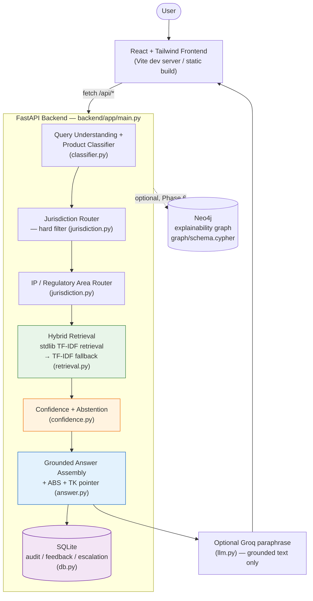
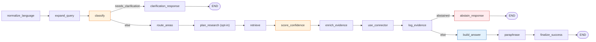
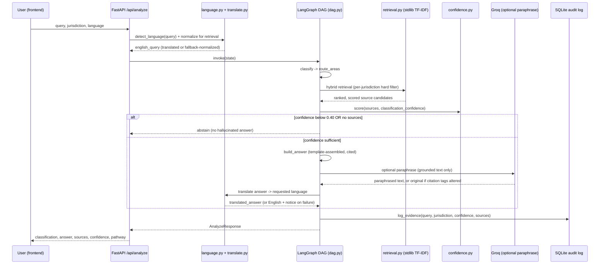
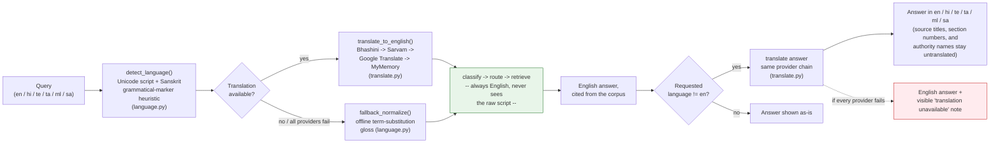
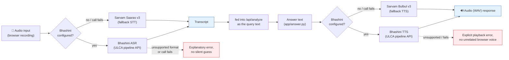
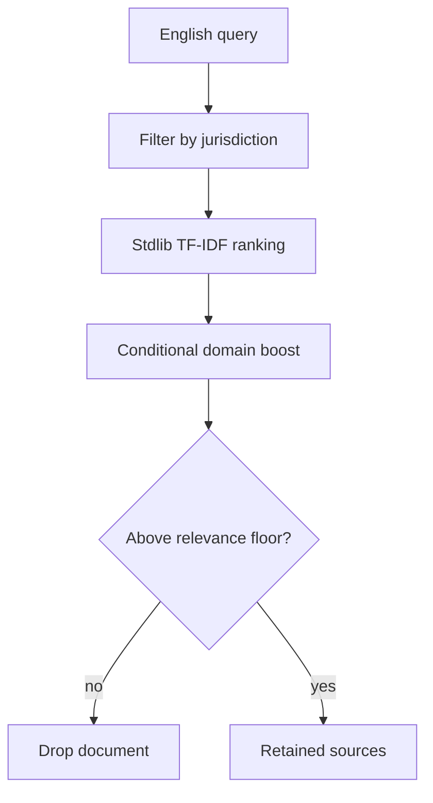

<div align="center">

# 🕉️ SUTRADHARA
### AI-Powered IP & Regulatory Intelligence for Ayurveda

**Team Chaturya · Smart India Hackathon 2026 · Problem Statement SIH26045**
**Nodal Ministry: Ministry of AYUSH — Sponsoring Body: All India Institute of Ayurveda (AIIA)**

[](backend)
[](frontend)
[](backend/app/dag.py)
[](backend/app/retrieval.py)
[](backend/app/language.py)
[](#9-known-limitations)

*A multilingual, citation-grounded RAG assistant that tells an Ayurvedic innovator*
*what IP and regulatory regime applies to their product — with a real citation*
*for every claim, and an honest "I don't know" instead of a guess.*

</div>

---

> **This is a working prototype, not a production system.** It prioritizes
> correctness, traceability, and jurisdictional clarity over feature count —
> per the problem statement's own restrictions (see `ARCHITECTURE.md` §26).

## Table of contents

1. [Why this exists](#1-why-this-exists)
2. [Six flagship features](#2-six-flagship-features-beyond-the-core-pipeline)
3. [Architecture](#3-architecture)
   - [3.1 System architecture](#31-system-architecture)
   - [3.2 Bounded research planner and pipeline DAG](#32-bounded-research-planner-and-pipeline-dag-appdagpy)
   - [3.3 Request sequence — one `/api/analyze` call](#33-request-sequence--one-apianalyze-call)
   - [3.4 Multilingual flow — 6 languages](#34-multilingual-flow--6-languages)
   - [3.5 Voice flow — ASR / TTS](#35-voice-flow--asr--tts)
   - [3.6 Hybrid retrieval, close up](#36-hybrid-retrieval-close-up)
4. [Quick start](#4-quick-start)
5. [API reference](#5-api-reference)
6. [Judge demo script (3–5 minutes)](#6-judge-demo-script-35-minutes)
7. [Testing](#7-testing)
8. [Project structure](#8-project-structure)
9. [Known limitations](#9-known-limitations-be-upfront-with-judges-about-these)
10. [Tech stack](#10-tech-stack)
11. [Feature assessment — vs. IP-SAKTI Sahayak](#11-feature-assessment--vs-ip-sakti-sahayak-another-teams-build)

---

## 1. Why this exists

Getting an Ayurvedic product to market means threading Patents Act §3(p)/§3(j)
"traditional knowledge" exclusions, the Biological Diversity Act's ABS
consent regime, Drugs & Cosmetics Act classical-vs-proprietary boundaries,
FSSAI Ayurveda-Aahar rules, GI/trademark/copyright overlap, and — the moment
export enters the picture — TRIPS Art. 27, CBD, the Nagoya Protocol, and the
WIPO GRATK Treaty. A generic chatbot will answer confidently and wrong. A
misclassification here can mean a rejected patent, a biopiracy allegation, or
a seized shipment.

SUTRADHARA answers **only** from a curated, jurisdiction-tagged corpus, cites
the exact source for every claim, and **abstains** rather than guesses when
the evidence isn't there.

## 2. Six flagship features (beyond the core classify → route → retrieve → cite pipeline)

| # | Feature | Where | What it actually does |
|---|---|---|---|
| 1 | **Dynamic multi-hop Knowledge Graph** | `app/graph_reasoning.py` → `POST /api/graph/reason` | Traced fresh from the live corpus for the chosen category/jurisdiction on **every call** — category → applicable IP area(s) → the actual corpus document(s) governing each — plus an optional, jurisdiction-isolated export-readiness branch. Not a static diagram. |
| 2 | **Live Evaluation Benchmark** | `app/eval_runner.py` → `GET /api/eval/benchmark` | Runs a 30-item labeled test set through the actual running app; reports freshly computed classification/abstention/clarification accuracy and citation hit rate, plus two hard invariants (jurisdiction-isolation violations, citation-integrity violations) that must read zero. |
| 3 | **Indicative Regulatory Pathway** | `app/pathway.py` | A deterministic, category × jurisdiction next-step checklist (which form, which authority) once an answer is produced. |
| 4 | **TKDL / prior-art resemblance scoring** | `app/tkdl_similarity.py` | TF-IDF similarity against a curated set of well-known classical formulations — quantifies "how close is this to known traditional knowledge" instead of only pointing at TKDL. |
| 5 | **IP Posture Summary PDF export** | `app/posture_pdf.py` → `POST /api/posture-pdf` | Turns one analysis into a downloadable, timestamped PDF, rendered from exactly what the UI already showed — nothing invented, nothing extra. |
| 6 | **Consent-logged source connectors** | `app/connectors.py` → `/api/connectors/*` | The USPTO PatentsView adapter performs live US-patent searches using the linked API key, encrypted at rest. Results stay separate from legal citations; other provider names remain clearly simulated until provider-specific adapters are implemented. |

Supporting the six features above, the core pipeline itself carries three
capabilities worth calling out on their own:

- 🌐 **6-language multilingual support** — English, Hindi (`hi`), Telugu
  (`te`), Tamil (`ta`), Malayalam (`ml`), and Sanskrit (`sa`), detected
  directly from the query's Unicode script (Devanagari, Sanskrit
  disambiguated from Hindi by grammatical markers, Tamil, Malayalam,
  Telugu) — see [§3.4](#34-multilingual-flow--6-languages).
- 🎙️ **Voice in, voice out** — Bhashini/Sarvam-backed speech-to-text and
  text-to-speech (`app/asr.py`, `POST /api/asr/transcribe`,
  `POST /api/tts/synthesize`) with six-language routing. English read-aloud
  uses the browser voice; Hindi, Telugu, Tamil, and Malayalam use backend
  speech. Sanskrit ASR is routed through the configured backend, while
  Sanskrit TTS is a documented Hindi-voice approximation (`hi-IN`) because
  the configured providers do not offer native Sanskrit TTS — see
  [§3.5](#35-voice-flow--asr--tts).
- 🌐 **Translated analysis controls** — query-depth/evidence controls and
  per-regime screening explanations use the selected language. Names and
  registry identifiers remain unchanged; a visible notice identifies any
  strings left in English when a translation provider is unavailable.
- 🔀 **Bounded research planning with deterministic fallback** — `POST
  /api/analyze` can use an explicitly enabled Groq planner to select up to
  three corpus searches within deterministic jurisdiction/area boundaries.
  The answer remains corpus-grounded; if planning is disabled or fails, the
  deterministic retrieval path runs — see [§3.2](#32-research-planning-and-pipeline-dag-appdagpy).

---

## 3. Architecture

### 3.1 System architecture


```mermaid
flowchart TD
    U(["User"]) --> FE["React + Tailwind Frontend\n(Vite dev server / static build)"]
    FE -->|"fetch /api/*"| API

    subgraph API["FastAPI Backend — backend/app/main.py"]
        direction TB
        CLS["Query Understanding +\nProduct Classifier\n(classifier.py)"]
        JUR["Jurisdiction Router\n— hard filter (jurisdiction.py)"]
        AREA["IP / Regulatory Area Router\n(jurisdiction.py)"]
        RET["Hybrid Retrieval\nstdlib TF-IDF retrieval\n→ TF-IDF fallback (retrieval.py)"]
        CONF["Confidence + Abstention\n(confidence.py)"]
        ANS["Grounded Answer Assembly\n+ ABS + TK pointer (answer.py)"]
        DB[("SQLite\naudit / feedback / escalation\n(db.py)")]
    end

    CLS --> JUR --> AREA --> RET --> CONF --> ANS --> DB

    ANS --> LLMOPT["Optional Groq paraphrase\n(llm.py) — grounded text only"]
    LLMOPT --> FE

    API -.->|"optional, Phase 6"| NEO[("Neo4j\nexplainability graph\ngraph/schema.cypher")]

    style RET fill:#e8f5e9,stroke:#2e7d32
    style CONF fill:#fff3e0,stroke:#ef6c00
    style ANS fill:#e3f2fd,stroke:#1565c0
    style DB fill:#f3e5f5,stroke:#6a1b9a
```

The answer is assembled from retrieved corpus sources. A bounded research
planner can optionally select additional corpus searches, but it cannot add
sources or write legal conclusions. An **optional Groq paraphrase layer**
(`app/llm.py`, model `openai/gpt-oss-120b`) runs only on the already-grounded
answer. It is constrained to paraphrase only — never to introduce a new
legal claim, statute, or citation — and every `[Source: ...]` tag is checked
programmatically after the call; if any tag was altered, added, or dropped,
the paraphrase is discarded and the grounded template answer is used
instead.

### 3.2 Bounded research planner and pipeline DAG (`app/dag.py`)

`POST /api/analyze` runs through a LangGraph `StateGraph` with deterministic
classification, jurisdiction checks, confidence gates, and response
assembly. If `ENABLE_LLM_RESEARCH_PLANNER=true` and `GROQ_API_KEY` is set,
the model may plan up to two `search_corpus` tool calls, inspect their
returned source metadata, and make one bounded follow-up decision (at most
one more call). Each search is restricted to an area already selected by
deterministic routing. The API response reports `orchestration_mode` and
executed `research_plan`. This is bounded tool planning, not open-ended legal
reasoning or authority to change jurisdiction or answer content.

The opt-in sends the normalized query to Groq; leave the setting disabled
if that external processing is not acceptable. With the planner disabled,
unconfigured, or returning an invalid/unavailable plan, the deterministic
query-expansion retrieval path is used.


```mermaid
flowchart LR
    A["normalize_language"] --> B["expand_query"] --> C["classify"]
    C -->|"needs_clarification"| CR["clarification_response"] --> END1(["END"])
    C -->|"else"| D["route_areas"] --> P["plan_research (opt-in)"] --> E["retrieve"] --> F["score_confidence"]
    F --> G["enrich_evidence"] --> H["use_connector"] --> I["log_evidence"]
    I -->|"abstained"| AB["abstain_response"] --> END2(["END"])
    I -->|"else"| J["build_answer"] --> K["paraphrase"] --> L["finalize_success"] --> END3(["END"])

    style C fill:#fff3e0,stroke:#ef6c00
    style F fill:#fff3e0,stroke:#ef6c00
    style J fill:#e3f2fd,stroke:#1565c0
    style AB fill:#ffebee,stroke:#c62828
```

If the `langgraph` package isn't installed, the exact same node functions run
through a hand-written sequential executor instead — same fallback pattern as
the stdlib TF-IDF retrieval below. `GET /api/health` reports which backend
(`langgraph` or `sequential`) actually executed via `dag_backend`.

### 3.3 Request sequence — one `/api/analyze` call


```mermaid
sequenceDiagram
    participant U as User (frontend)
    participant API as FastAPI /api/analyze
    participant LANG as language.py + translate.py
    participant DAG as LangGraph DAG (dag.py)
    participant RET as retrieval.py (stdlib TF-IDF)
    participant CONF as confidence.py
    participant LLM as Groq (optional paraphrase)
    participant DB as SQLite audit log

    U->>API: query, jurisdiction, language
    API->>LANG: detect_language(query) + normalize for retrieval
    LANG-->>API: english_query (translated or fallback-normalized)
    API->>DAG: invoke(state)
    DAG->>DAG: classify -> route_areas
    DAG->>RET: hybrid retrieval (per-jurisdiction hard filter)
    RET-->>DAG: ranked, scored source candidates
    DAG->>CONF: score(sources, classification_confidence)
    alt confidence below 0.40 OR no sources
        DAG-->>API: abstain (no hallucinated answer)
    else confidence sufficient
        DAG->>DAG: build_answer (template-assembled, cited)
        DAG->>LLM: optional paraphrase (grounded text only)
        LLM-->>DAG: paraphrased text, or original if citation tags altered
        DAG->>LANG: translate answer -> requested language
        LANG-->>DAG: translated_answer (or English + notice on failure)
    end
    DAG->>DB: log_evidence(query, jurisdiction, confidence, sources)
    DAG-->>API: AnalyzeResponse
    API-->>U: classification, answer, sources, confidence, pathway
```

### 3.4 Multilingual flow — 6 languages

The single design decision that keeps 6-language support tractable:
**retrieval, classification, and routing only ever see English.** Language
handling happens only at the two edges.


```mermaid
flowchart LR
    Q["Query\n(en / hi / te / ta / ml / sa)"] --> D["detect_language()\nUnicode script + Sanskrit\ngrammatical-marker heuristic\n(language.py)"]
    D --> T1{"Translation\navailable?"}
    T1 -->|"yes"| TR1["translate_to_english()\nBhashini -> Sarvam ->\nGoogle Translate -> MyMemory\n(translate.py)"]
    T1 -->|"no / all providers fail"| FB1["fallback_normalize()\noffline term-substitution\ngloss (language.py)"]
    TR1 --> PIPE["classify -> route -> retrieve\n-- always English, never sees\nthe raw script --"]
    FB1 --> PIPE
    PIPE --> ANS["English answer,\ncited from the corpus"]
    ANS --> T2{"Requested\nlanguage != en?"}
    T2 -->|"yes"| TR2["translate answer\nsame provider chain\n(translate.py)"]
    T2 -->|"no"| OUT["Answer shown as-is"]
    TR2 --> OUT2["Answer in en / hi / te / ta / ml / sa\n(source titles, section numbers, and\nauthority names stay untranslated)"]
    TR2 -.->|"if every provider fails"| SAFE["English answer +\nvisible 'translation unavailable' note"]

    style PIPE fill:#e8f5e9,stroke:#2e7d32
    style SAFE fill:#ffebee,stroke:#c62828
```

`en` skips both translation calls entirely — zero added latency, identical
behavior to a language-unaware system. Verified in testing to fail safe:
with no route to Google Translate / Hugging Face (the sandbox this was built
in), the query falls back to the offline gloss and the answer falls back to
English with a visible note — exactly the behavior a judging venue with
flaky internet would see.

The same provider chain is exposed as `POST /api/translate` for batched
feature-workspace labels and generated explanatory text. It accepts target
languages `en`, `hi`, `te`, `ta`, `ml`, and `sa`; each item reports whether
translation succeeded so the UI can retain English fallback text and show
an explicit notice rather than claiming an untranslated string is localized.

### 3.5 Voice flow — ASR / TTS


```mermaid
flowchart LR
    MIC["🎤 Audio input\n(browser recording)"] --> ASR1{"Bhashini\nconfigured?"}
    ASR1 -->|"yes"| BASR["Bhashini ASR\n(ULCA pipeline API)"]
    ASR1 -->|"no / call fails"| SASR["Sarvam Saaras v3\n(fallback STT)"]
    BASR --> TXT["Transcript"]
    SASR --> TXT
    BASR -.->|"unsupported format\nor call fails"| FAILASR["Explanatory error,\nno silent guess"]

    TXT --> ANALYZE["fed into /api/analyze\nas the query text"]
    ANALYZE --> ANSWER["Answer text\n(app/answer.py)"]

    ANSWER --> TTS1{"Bhashini\nconfigured?"}
    TTS1 -->|"yes"| BTTS["Bhashini TTS\n(ULCA pipeline API)"]
    TTS1 -->|"no / call fails"| STTS["Sarvam Bulbul v3\n(fallback TTS)"]
    BTTS --> AUD["🔊 Audio (WAV) response"]
    STTS --> AUD
    BTTS -.->|"unsupported / fails"| NOAUD["Explicit playback error,\nno unrelated browser voice"]

    style TXT fill:#e3f2fd,stroke:#1565c0
    style AUD fill:#e3f2fd,stroke:#1565c0
    style FAILASR fill:#ffebee,stroke:#c62828
    style NOAUD fill:#ffebee,stroke:#c62828
```

Both directions follow the same provider-chain shape as text translation
(`app/translate.py`): Bhashini first as the national-language-infrastructure
default, Sarvam as the authenticated fallback — implemented in `app/asr.py`.

The microphone normalizes supported recordings to mono 16 kHz PCM WAV when
the browser can decode them, and otherwise sends the original container
with its actual capture sample rate. Backend ASR supports all six language
codes and falls back to browser recognition if the configured service is
unavailable. Backend TTS is used for Hindi, Telugu, Tamil, Malayalam, and
Sanskrit; English uses a matching browser voice. Sanskrit ASR is requested
as `sa-IN`, while Sanskrit TTS maps to the closest supported Hindi voice
(`hi-IN`) because native Sanskrit TTS is unavailable. A non-English TTS
provider or playback failure is surfaced instead of speaking through an
unrelated browser voice. Live NMT/ASR/TTS quality still depends on provider
availability, credentials, and language support in the deployment.

### 3.6 Retrieval, close up

The backend uses standard-library TF-IDF with cosine similarity. Candidate documents are hard-filtered by jurisdiction before ranking, and the domain boost applies only after a lexical match.


```mermaid
flowchart TD
    QRY["English query"] --> HARD["Filter by jurisdiction"]
    HARD --> SCORE["Stdlib TF-IDF ranking"]
    SCORE --> BOOST["Conditional domain boost"]
    BOOST --> FLOOR{"Above relevance floor?"}
    FLOOR -->|"no"| DROP["Drop document"]
    FLOOR -->|"yes"| RETAIN["Retained sources"]
```

---

## 4. Quick start

### Backend

```bash
cd backend
python3 -m venv venv && source venv/bin/activate     # optional but recommended
pip install -r requirements.txt
cp .env.example .env   # add GROQ_API_KEY for the paraphrase layer; blank works fine
uvicorn app.main:app --reload --port 8000
```

Check it's alive: `curl http://127.0.0.1:8000/api/health`

The system works fully with `GROQ_API_KEY` left blank — the grounded,
template-assembled answer is returned as-is (`llm_paraphrased: false`). Set
`GROQ_API_KEY` and `GROQ_MODEL` in `.env` to enable the optional Groq
paraphrase pass. For live translation and voice beyond the offline
fallbacks, optionally set `BHASHINI_NMT_USER_ID` / `BHASHINI_NMT_API_KEY`
(or `BHASHINI_USER_ID` / `BHASHINI_API_KEY`) and/or `SARVAM_API_KEY`.

### Frontend

```bash
cd frontend
npm install
npm run dev
```

Open the printed URL (default `http://127.0.0.1:5173`). The Vite dev server
proxies `/api/*` to `http://127.0.0.1:8000` (see `vite.config.js`) — make sure
the backend is running first.

### Neo4j (optional — Phase 6, not required for the core demo)

The prototype's `/api/graph` endpoint returns a static explainability graph
that works without Neo4j. If you want the real graph database running:

```bash
cat backend/graph/schema.cypher | cypher-shell -u neo4j -p <password>
```

---

## 5. API reference

| Method | Path | Purpose |
|---|---|---|
| `POST` | `/api/analyze` | Full pipeline: classification → routing → retrieval → answer / abstention |
| `POST` | `/api/query` | Alias for `/api/analyze` (spec compatibility) |
| `GET` | `/api/sources/{doc_id}` | Fetch one corpus document's full metadata |
| `GET` | `/api/graph` | Static explainability graph (node/edge **types**) |
| `POST` | `/api/graph/reason` | 🔑 Live, jurisdiction-aware multi-hop graph traversal for one category |
| `GET` | `/api/eval` | Real logged evaluation stats (never fabricated) |
| `GET` | `/api/eval/benchmark` | 🔑 Runs the 30-item labeled benchmark live and reports fresh metrics |
| `POST` | `/api/posture-pdf` | 🔑 Renders one analysis result as a downloadable PDF |
| `POST` | `/api/feedback` | Log a rating / comment |
| `POST` | `/api/escalate` | Log a human-facilitator escalation |
| `POST` | `/api/connectors/link` | 🔑 Link a source connector (PatentsView supports live US-patent searches) |
| `POST` | `/api/connectors/revoke` | 🔑 Revoke a linked connector (fails closed immediately) |
| `GET` | `/api/connectors` | List the user's linked connectors |
| `GET` | `/api/connectors/{id}/usage` | Usage log for one connector |
| `POST` | `/api/asr/transcribe` | 🎙️ Speech-to-text (Bhashini → Sarvam Saaras) |
| `POST` | `/api/tts/synthesize` | 🔊 Text-to-speech (Bhashini → Sarvam Bulbul) |
| `POST` | `/api/privacy/consent/{id}/access` | Append an authenticated consent access-log entry |
| `GET` | `/api/health` | Liveness, corpus size, active retrieval/DAG backend |

🔑 = one of the six flagship features (see [§2](#2-six-flagship-features-beyond-the-core-pipeline)).

Request/response shapes are Pydantic models in `app/schemas.py`.
To enable the live PatentsView connector, install backend requirements and set
`CONNECTOR_ENCRYPTION_KEY` to a stable Fernet key (generate it with
`python -c "from cryptography.fernet import Fernet; print(Fernet.generate_key().decode())"`).
Keep this secret backed up: rotating it makes previously linked keys unreadable.
Linked API keys are encrypted at rest; live search records are returned separately
from the legal corpus and are never treated as legal citations.

### Analysis and privacy controls

The analysis request also accepts `query_depth` (`quick`, `guided`, or `deep`).

---

## 6. Judge demo script (3–5 minutes)

**Demo 1 — India, classical formulation (core scenario)**
1. Jurisdiction: 🇮🇳 India
2. Ask: *"Can I patent a classical Ayurvedic formulation?"*
3. Show: classification (Classical / Generic Medicine), applicable areas
   (Patents, Traditional Knowledge, ABS), the grounded answer citing
   Patents Act §3(p)/§3(j) and the Drugs & Cosmetics Act, the Traditional
   Knowledge / Prior-Art Pointer, and the confidence breakdown.

**Demo 2 — jurisdiction switch**
1. Switch to 🌍 International, ask the same question.
2. Show the answer and source set change completely — now TRIPS Art. 27,
   CBD, Nagoya Protocol, TKDL — with **zero** Indian statutes present.

**Demo 3 — safe abstention**
1. Ask an out-of-scope question. Two variants are worth showing:
   - *"What is the boiling point of tungsten?"* — no classifier signal at
     all, so the system asks a clarification question rather than guessing.
   - A query that classifies fine but has no supporting evidence — the
     system returns "Insufficient authoritative evidence to provide a
     reliable answer" and offers escalation.
   Either way: never a hallucinated legal claim.

**Demo 4 — multilingual UI, any of six languages**
1. Toggle English → हिंदी / తెలుగు / தமிழ் / മലയാളം / संस्कृत, or type the
   query directly in that script.
2. The query is translated to English for retrieval (so the same evidence
   surfaces regardless of input language — see [§3.4](#34-multilingual-flow--6-languages)),
   and the generated answer is translated back for display. Source titles,
   section numbers, and authority names stay untranslated, since those are
   official identifiers.
3. Optionally, use the mic button to ask by voice and "Read Aloud" to hear
   the answer spoken back (see [§3.5](#35-voice-flow--asr--tts)).

Optional, if time allows: show the **Knowledge Graph** tab (live multi-hop
reasoning, not a static diagram), the **Evaluation Dashboard** tab (real
logged stats, run the live benchmark), and export an **IP Posture Summary
PDF** from a completed analysis.

---

## 7. Testing

`backend/data/test_queries.json` has 8 manually curated test queries
(TQ-01–TQ-08) for manual verification via the Evaluation Dashboard — no
scores are auto-generated or fabricated.

`backend/tests/` has automated pytest coverage across retrieval, the
deterministic DAG, multilingual translation, voice (ASR/TTS, mocked
provider calls), graph reasoning, the eval benchmark runner, connectors,
and citation integrity:

```bash
cd backend
pip install -r requirements.txt
pytest tests/ -v
```

| Test file | Covers |
|---|---|
| `test_multilingual.py` | Language detection, evidence equivalence across all 6 languages, unsupported-query abstention, and (network permitting) the real translation path |
| `test_bhashini.py` / `test_bhashini_voice.py` | Bhashini translation and ASR/TTS provider chain, including fallback to Sarvam |
| `test_asr.py` | Speech-to-text request handling |
| `test_retrieval_and_citations.py` | Both demo scenarios, India/International jurisdiction isolation, citation-field completeness, corpus size |
| `test_deterministic_dag.py` | LangGraph vs. sequential-executor output equivalence |
| `test_graph_reasoning.py` | Live multi-hop knowledge-graph traversal |
| `test_eval_benchmark.py` | The live 30-item evaluation benchmark runner |
| `test_connectors.py` | Connector link / use / revoke consent lifecycle |
| `test_llm_paraphrase.py` | Citation-tag integrity check that gates the Groq paraphrase |
| `test_new_features.py` | Pathway checklist, TKDL similarity, posture PDF |
| `test_feature_workflows.py` | Removed workflow routes, query depth, score, consent access logs |

One test (`test_live_translation_path`) is skipped rather than failed if the
machine running it has no internet access.

---

## 8. Project structure

```
sutradhara/
├── README.md                  (this file)
├── ARCHITECTURE.md            (full system design: A–S deliverables)
├── backend/
│   ├── app/
│   │   ├── main.py             FastAPI app + all endpoints
│   │   ├── dag.py               Deterministic LangGraph pipeline orchestration
│   │   ├── classifier.py        Product classification (rule-based, 6 categories)
│   │   ├── jurisdiction.py      Jurisdiction + IP-area routing
│   │   ├── retrieval.py         standard-library TF-IDF retrieval
│   │   ├── query_expansion.py   Domain-concept query-variant expansion
│   │   ├── language.py          Script-based input-language detection (6 languages)
│   │   ├── translate.py         Bhashini → Sarvam → Google → MyMemory translation chain
│   │   ├── asr.py                Bhashini → Sarvam speech-to-text / text-to-speech
│   │   ├── confidence.py        Evidence-based confidence + abstention
│   │   ├── answer.py             Grounded answer / ABS checklist / TK pointer
│   │   ├── graph_reasoning.py   🔑 Live multi-hop knowledge-graph traversal
│   │   ├── graph.py              Static explainability graph (node/edge types)
│   │   ├── eval_runner.py       🔑 Live evaluation benchmark runner
│   │   ├── pathway.py           🔑 Indicative regulatory pathway checklist
│   │   ├── tkdl_similarity.py   🔑 TKDL / prior-art resemblance scoring
│   │   ├── posture_pdf.py       🔑 IP Posture Summary PDF export
│   │   ├── features.py          🔑 Regime verdicts, consent logs, analysis checks
│   │   ├── connectors.py        🔑 Consent-logged source connectors
│   │   ├── llm.py                Optional Groq paraphrase layer
│   │   ├── db.py                  SQLite audit log / feedback / escalation
│   │   └── schemas.py            Pydantic request/response models
│   ├── data/
│   │   ├── corpus.json          45-document curated knowledge corpus
│   │   ├── test_queries.json    Manually verified test set
│   │   └── eval_dataset.json    30-item labeled evaluation benchmark
│   ├── graph/
│   │   └── schema.cypher        Neo4j schema + seed data
│   ├── tests/                   Automated pytest suite (see §7)
│   └── requirements.txt
└── frontend/
    ├── src/
    │   ├── App.jsx               Main analyze flow
    │   ├── api.js                 API client
    │   ├── copy.js                UI strings, all 6 languages
    │   └── components/            JurisdictionSwitch, ConfidenceMeter,
    │                               SourceCard, EscalationModal,
    │                               KnowledgeGraphView, EvalDashboard
    └── (Vite + Tailwind config)
```

---

## 9. Known limitations (be upfront with judges about these)

- The corpus is a curated prototype set (45 documents — 23 India + 22
  International, including the 2024 Patents/Biodiversity Rules and the WIPO
  GRATK Treaty, five Indian case-law entries, and additional EU/US herbal
  market guidance plus the UK's MHRA Traditional Herbal Registration route and
  Health Canada's Natural Health Products licensing/database pathway),
  not the full legal universe — by design (see brief §7),
  though now covering patents/TKDL, drugs & cosmetics, ABS/biodiversity, GI,
  trademarks, copyright, designs, plant variety protection, FSSAI, and the
  major WIPO-administered treaties (PCT, Madrid, Hague, Berne, Paris) plus
  UPOV.
- Retrieval uses standard-library TF-IDF cosine similarity with jurisdiction filtering; there is no downloaded embedding model or native vector dependency.
- The answer is template-assembled directly from retrieved source summaries
  (guaranteed grounded) and then optionally passed through a Groq
  (`openai/gpt-oss-120b`) paraphrase layer purely for readability. The
  paraphrase is discarded automatically — falling back to the grounded
  template text — if any `[Source: ...]` citation tag is altered, or if
  `GROQ_API_KEY` is unset / the call fails for any reason (this sandbox has
  no outbound route to `api.groq.com`, so it was verified to fall back
  correctly, not verified against a live response — do that sanity check
  once you have it running with internet and a real key).
- TKDL is represented as a reference workflow only; this prototype does not
  and cannot connect to the real, access-restricted TKDL database.
- Multilingual support (6 languages) translates both the incoming query
  (for retrieval) and the generated answer (for display) live via a
  provider chain — Bhashini first, then Sarvam, then Google Translate /
  MyMemory (through `deep-translator`, no API key needed for the last two)
  — this requires internet access at request time and was verified to fail
  safe (falls back to an offline term-substitution gloss for the query, and
  to English with a visible note for the answer) when every translation
  service is unreachable, since that's exactly what happens in the sandbox
  this was built in.
- Voice (ASR/TTS) follows the same Bhashini → Sarvam provider chain and the
  same fail-safe philosophy: an unsupported audio format or unreachable
  provider produces an explanatory error, never a silent guess at what was
  said or an unrelated non-English voice.
- Corpus entries include their source URLs and a `precision` note. A curated
  corpus is not exhaustive; source availability, amendments, product
  classifications, and jurisdiction-specific eligibility should be checked
  against current primary material before relying on a filing decision.
- The entries added later (`IN-PHARMACOPOEIA-API`, `IN-CASELAW-DIVYA-PHARMACY`,
  and the export-market regimes `INTL-EU-THMPD-2004`, `INTL-US-DSHEA-1994`,
  `INTL-EU-NAGOYA-REG-511-2014`, `INTL-UK-THR-2012`, and
  `INTL-CA-NHP-2003`) were checked against
  official sources (including EUR-Lex, US FDA, PCIM&H, MHRA, and Health Canada) or, for the
  case, a specialist legal analysis —
  each states its own confidence in its `precision` field. The export-market
  entries now cover the EU, UK, Canada, and US; other export markets are not in the
  corpus. The 30/15-year EU/UK traditional-use rules and US claim/cGMP
  rules should be re-checked against the current text before any filing.
- Trade secrets previously routed to zero corpus documents (a query would
  silently abstain); closed with a real India common-law/contract entry
  (Indian Contract Act s.27, breach-of-confidence doctrine — India has no
  dedicated trade-secret statute, confirmed against legal commentary since
  none exists) and TRIPS Article 39 (undisclosed information) internationally.
- Case law was thin (one entry). Added two, both verified against multiple
  independent legal-commentary sources: *Gujarat Bottling Co. v. Coca Cola
  Co.* (1995) 5 SCC 545 — the Supreme Court authority behind why a
  confidentiality/non-compete clause is enforceable only for the duration
  of an agreement, backing the trade-secret entry above — and *Tea Board,
  India v. ITC Limited* (Calcutta HC, 2011), the first Indian GI-infringement
  decision, holding GI protection is confined to goods and doesn't extend
  to unrelated services.
- Bias/fairness auditing was entirely unaddressed. Added `app/bias_audit.py`
  (`GET /api/privacy/bias-audit`, stdlib only): a static scan of this app's
  own templates for gendered pronouns (currently clean), plus a dynamic
  persona-invariance check that runs the real classify/route/retrieve
  pipeline on matched query sets varying only a stated persona. Run for
  real rather than assumed clean — it found a genuine issue and reports it
  rather than hiding it: an "individual vs. corporation" framing of an
  identical legal question shifts which documents the TF-IDF layer
  retrieves (Plant Variety Protection vs. the Pharmacopoeia entry), because
  incidental vocabulary in each framing happens to overlap with unrelated
  corpus content. Two other axes tested (gender-coded name, region-coded
  name) showed no drift. This is disclosed as a known retrieval-layer
  limitation, not silently fixed by reweighting retrieval broadly.

- The evaluation benchmark's multilingual coverage was thin (2 of 20 items,
  missing 3 of the app's 6 languages entirely). Added 5 items: 2 English
  trade-secret checks plus the first-ever Tamil, Malayalam, and Sanskrit
  benchmark items — every supported language now has at least one. Each
  non-English item's underlying English meaning was independently verified
  against live retrieval before translation; the translations themselves,
  and whether they round-trip correctly through live Bhashini/Sarvam, have
  not been checked in this sandbox (no network) — see each item's own
  `notes` field, and the Sanskrit item names its own extra uncertainty
  (no classical precedent for "National Biodiversity Authority").
- Accounts and chat history: passwords use salted PBKDF2, login tokens are
  stored hashed and expire, and every chat route derives identity from the
  token (a client-supplied `user_id` is only cross-checked). Account export,
  erasure, and privacy access are authenticated and scoped to the token owner.
  Query-text lookups are disabled in the public privacy API because historical
  logs are not associated with account owners. The retention-purge endpoint
  requires `SUTRADHARA_PRIVACY_PURGE_TOKEN` in `X-Privacy-Purge-Token` and uses
  the server-configured retention window; callers cannot shorten it. Legacy
  single-round SHA-256 password hashes are rejected and need a trusted,
  administrator-mediated reset; no self-service reset flow is implemented.
  MFA/email verification are also not implemented, and the sign-in rate
  limiter is in-process (single-instance only).
- The rule-based classifier handles the specific "not found in a classical
  text" negation pattern explicitly (a real bug caught while testing Demo
  Scenario 2 — see `classifier.py`), but it is still keyword/pattern-based,
  not a general NLP classifier, so unusual phrasings of the same intent may
  not be recognized.

---

## 10. Tech stack

| Layer | Choice |
|---|---|
| Orchestration | LangGraph `StateGraph`; opt-in bounded Groq retrieval planner; deterministic fallback |
| API | FastAPI |
| Retrieval | Standard-library TF-IDF cosine similarity with jurisdiction filtering |
| Translation | Bhashini (MeitY/ULCA) → Sarvam AI → Google Translate → MyMemory, via `deep-translator` |
| Voice | Bhashini ASR/TTS → Sarvam Saaras (STT) / Bulbul (TTS) |
| Optional paraphrase LLM | Groq, `openai/gpt-oss-120b` — citation-tag-gated, never mandatory |
| Explainability graph | Neo4j (optional, Phase 6) with an in-memory live-traversal fallback |
| PDF export | ReportLab |
| Storage | SQLite (audit log, feedback, escalation) |
| Frontend | React + Vite + Tailwind CSS |

---

## 11. Feature assessment — vs. IP-SAKTI Sahayak (another team's build)

A separate, unaffiliated team built a tool called **IP-SAKTI Sahayak**,
covering similar ground (Ayurvedic-product IP navigation). This assessment
is based only on a ~4-minute demo video of that tool, not its code, so it
compares stated/shown capabilities, not verified implementations — the same
"live vs. mocked" question this README asks of its own six flagship
features in §9 applies equally to theirs, and can't be answered from a
video alone.

**Already covered here** (not re-described — see the linked section):
product classification into a category ([§1](#1-why-this-exists),
`classifier.py`), IP-pathway suggestion across patent/trademark/design/
copyright/GI/trade-secret ([`app/pathway.py`](backend/app/pathway.py)),
a prior-art/TKDL resemblance check (flagship feature 4,
`app/tkdl_similarity.py`), and a consolidated multi-act knowledge base —
SUTRADHARA's corpus already spans the acts named in the video plus GI,
copyright, designs, plant-variety protection, FSSAI, and the major
WIPO-administered treaties (§9).

**Capabilities shown in the video that SUTRADHARA does not have today:**

| # | Their capability (video timestamp) | Gap here | Note |
|---|---|---|---|
| 1 | Structured product-intake form — name, description, type, **ingredient list**, **source location** (0:40) | No structured intake; the query is free text only, and ingredients/source-location are never captured as their own fields anywhere in the pipeline | Source-location capture in particular is relevant to ABS/biodiversity-consent triage (§1) and is a real, containable gap, not a blocked one |
| 2 | Business-goal selector — launch / protect formulation / explore patentability / ensure compliance (1:14) — reportedly changes the recommended path | `pathway.py` branches on category × jurisdiction only, not on stated business intent | Would need a new input + a small rule extension, not a new subsystem |
| 3 | Composite "AI Health Score" split into regulatory clarity / IP readiness / prior-art risk (1:57) | `ConfidenceMeter.jsx` scores confidence *in the generated answer*; `tkdl_similarity.py` scores prior-art resemblance alone; nothing combines three product-level dimensions into one score | Worth flagging a tension, not just a gap: SUTRADHARA's whole design is "cite exact sources, abstain rather than guess" (§1) — a single composite score risks implying more certainty than three separately-sourced, differently-reliable signals actually support. Any version of this should keep the three numbers visibly separate, not just their average |
| 4 | IP cost estimator — computed government fee amounts (3:12) | `pathway.py` names the form and authority but never a fee figure | Lower-risk to build for real than it looks: India's patent/trademark/GI fee schedules are official, published, fixed-amount tables (not a live portal query), so this doesn't run into the TKDL/InPASS access-control walls §9 already documents |
| 5 | One combined patent-search panel — similarity + publication status + source links together (2:24) | The equivalent pieces exist separately here (`tkdl_similarity.py`, `registry_lookup.py`, `graph_reasoning.py`) but aren't composed into a single results view | Presentation/composition gap more than a backend one |

None of this has been implemented — this is an assessment only, per
instruction. If any of #1–#5 above is worth building, it should be scoped
and actioned as its own explicit request rather than folded into this one.

---

<div align="center">

Built for **Smart India Hackathon 2026** · Problem Statement **SIH26045** · Team **Chaturya**

*Not legal advice. See `LEGAL_CONTENT_REVIEW.md` for the full disclaimer.*

</div>
